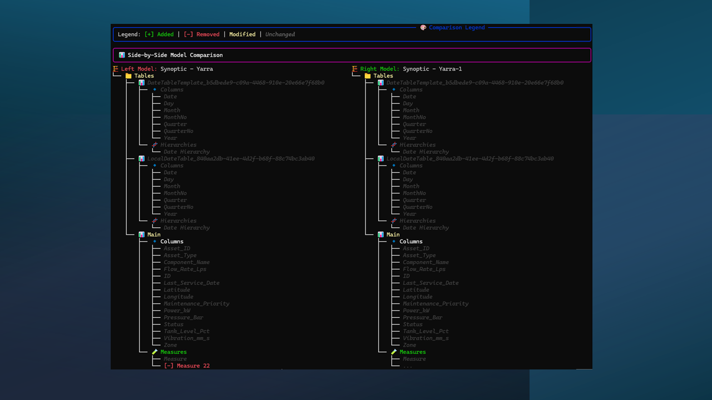

# TMDL-DIFF CLI

```text
\033[38;2;64;224;208m████████╗███╗   ███╗██████╗ ██╗         ██████╗ ██╗███████╗███████╗\033[0m
\033[38;2;56;210;200m╚══██╔══╝████╗ ████║██╔══██╗██║         ██╔══██╗██║██╔════╝██╔════╝\033[0m
\033[38;2;48;196;192m   ██║   ██╔████╔██║██║  ██║██║         ██║  ██║██║█████╗  █████╗  \033[0m
\033[38;2;40;182;184m   ██║   ██║╚██╔╝██║██║  ██║██║         ██║  ██║██║██╔══╝  ██╔══╝  \033[0m
\033[38;2;32;168;176m   ██║   ██║ ╚═╝ ██║██████╔╝███████╗    ██████╔╝██║██║     ██║     \033[0m
\033[38;2;24;154;168m   ╚═╝   ╚═╝     ╚═╝╚═════╝ ╚══════╝    ╚═════╝ ╚═╝╚═╝     ╚═╝     \033[0m
\033[38;2;16;140;160m             [ SEMANTIC POWER BI COMPARISON TOOL ]\033[0m
```

**Stop hunting for broken visuals. Start comparing.**

`tmdl-diff` is a high-level semantic comparison tool for Power BI developers. It compares TMDL (Tabular Model Definition Language) and PBIP (Power BI Project) files to instantly identify structural changes that break reports.

## ✨ Key Value
- **Visual Integrity**: Quickly see if a structural change (like a rename) will impact your report visuals.
- **Semantic Diff**: Goes beyond text comparison to understand Tables, Measures, and Columns.
- **CLI Speed**: No need to open heavy PBIX files just to see what's different between versions.
- **Live Detection**: Identify and inspect open Power BI Desktop instances on your machine.

## 📦 Installation

```bash
pip install tmdl-diff
```

## 🚀 Quick Usage

### 1. Compare two Project Files (.pbip)
```bash
tmdl-diff diff version1.pbip version2.pbip
```

### 2. List Open Instances & Files
```bash
tmdl-diff list
```

### 3. Interactive Comparison
```bash
tmdl-diff compare
```

## 🖼️ Visual Preview



## 📄 License
MIT
